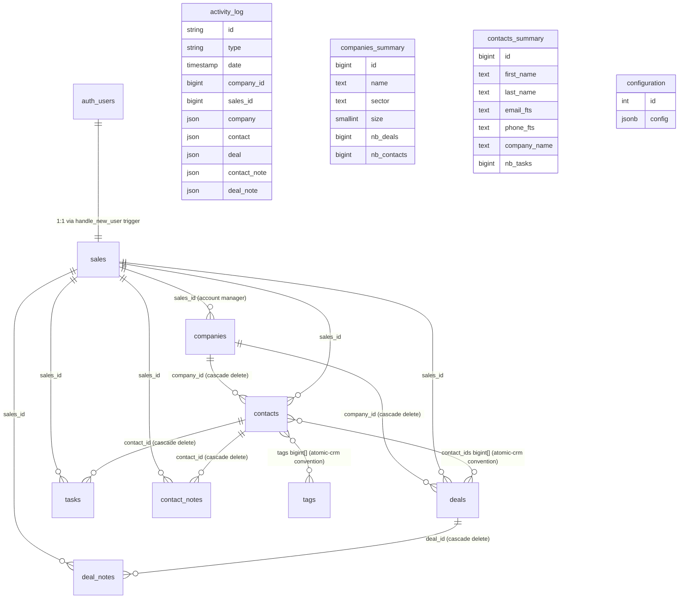

# Atomic CRM — Domain Model Review

**Repo:** https://github.com/marmelab/atomic-crm
**Stack:** React + Vite + Supabase + react-admin (shadcn-admin-kit / ra-core)
**Reviewed:** 2026-09-23
**Purpose:** Cherry-pick patterns for Kavora CRM v2 (an AI-native CRM with working Twilio + RAG + lead scoring)

---

## TL;DR

- **Borrow**: flat `tags bigint[]` array on contacts (cheap, no join table, perfect for AI enrichment), `jsonb` for typed multi-value fields (`email_jsonb`, `phone_jsonb`), `contacts_summary` / `companies_summary` DB views for list screens, `activity_log` UNION view for the unified timeline, and the `merging contacts` PL/pgSQL function — this is gold for de-dup.
- **Borrow**: the "settings as code" + "settings as DB row" hybrid — sector/stage/category choices are seeded from code (typed slugs, ship-friendly) and runtime-editable in a singleton `configuration` JSONB row. Best of both worlds.
- **Borrow**: the **per-resource lifecycle callbacks** pattern in the data provider (`withLifecycleCallbacks`) for file uploads, full-text search injection, and `sales_id` defaults.
- **Borrow**: the `email_jsonb` / `phone_jsonb` shape — `[{ email, type: "Work" | "Home" | "Other" }]` — matches every real CRM I have ever seen and supports Kavora's "multiple contact channels" need out of the box.
- **Borrow**: the inbound-email edge function (`supabase/functions/postmark/`) — the routing logic ("who sent it, who received it, which contact, attach to which note") maps 1:1 onto Kavora's Twilio SMS webhook pattern.
- **Skip**: their RLS model (everything is wide-open per-authenticated, no row-level tenancy). Kavora is single-tenant per workspace, but the pattern doesn't generalize.
- **Skip**: the React Admin `ra-supabase-core` data provider — it's tightly coupled to Supabase. Kavora uses Next.js + Drizzle, so we reimplement the patterns.
- **Skip**: their "configuration" pipeline (postgREST views, Postmark-incoming, multiscreen `CRM`/`MobileAdmin` split). They are a framework, not a product.
- **Biggest surprise**: Atomic CRM has **no runtime custom-field framework**. You add fields by ALTER TABLE + migration + view update + fakerest seed update. They lean into this (see `doc/src/content/docs/developers/custom-fields.mdx`). For Kavora's "AI suggests field, user accepts" workflow, we will need to build something they explicitly didn't.
- **Biggest surprise #2**: their `activity_log` is a SQL view built with `UNION ALL` over five tables — not an event store. They treat "creation" as the only meaningful event. For Kavora's Twilio-call + AI-touch timeline, we'll need a real event-sourcing table.

---

## 1. Entities

Atomic CRM has **9 entities** in `supabase/schemas/01_tables.sql`. They are small and intentionally narrow — derived/cross-cutting data lives in views, and runtime configuration lives in a JSONB singleton.

### `companies`
**Source:** `supabase/schemas/01_tables.sql:13-33` and `src/components/atomic-crm/types.ts:54-75`

```sql
create table public.companies (
    id bigint generated by default as identity primary key,
    created_at timestamp with time zone not null default now(),
    name text not null,
    sector text,                       -- slug (e.g. "information-technology")
    size smallint,                     -- bucketed: 1, 10, 50, 250, 500
    linkedin_url text,
    website extensions.citext,         -- case-insensitive text
    phone_number text,
    address text, zipcode text, city text, state_abbr text, country text,
    sales_id bigint,                   -- FK to sales (account manager)
    context_links json,                -- array of URLs (free-form context)
    description text,
    revenue text,
    tax_identifier text,
    logo jsonb                         -- { src, title } | null
);
```

**What to borrow:** `extensions.citext` for website/email columns — case-insensitive equality without uppercase-on-write hassle. The `context_links json` (untyped array of URLs) is a poor man's "custom field" — they get away with it because companies are shallow. Kavora should do better.
**What to skip:** `size smallint` as a bucket enum — `companies/sizes.ts:1` maps it to `1 | 10 | 50 | 250 | 500`. Numeric buckets are a Marmelab convention; Kavora can use a `team_size_range` enum with explicit string values.

### `contacts`
**Source:** `supabase/schemas/01_tables.sql:35-53`, `src/components/atomic-crm/types.ts:77-106`

```sql
create table public.contacts (
    id bigint generated by default as identity primary key,
    first_name text, last_name text, gender text, title text, background text,
    avatar jsonb,                                  -- { src, title } | null
    first_seen timestamp with time zone,
    last_seen timestamp with time zone,
    has_newsletter boolean,
    status text,                                   -- "cold" | "warm" | "hot" | "in-contract"
    tags bigint[],                                 -- ⚠ flat array, no join table
    company_id bigint references companies(id) on delete cascade,
    sales_id bigint references sales(id),
    linkedin_url text,
    email_jsonb jsonb,                             -- [{ email, type: "Work"|"Home"|"Other" }]
    phone_jsonb jsonb                              -- [{ number, type: "Work"|"Home"|"Other" }]
);
```

**Key calls:**
- `tags bigint[]` (line 47) — flat array, not a junction table. Cheaper than a `contact_tags` join table for the patterns they care about. See §6.
- `email_jsonb` / `phone_jsonb` (lines 51-52) — typed JSON arrays, not EAV. The migration from "single email per contact" to "multi-channel" is just an array push. See §8.
- `gender`, `status` are loose `text` — they validate against code-defined choice lists at write time but the DB doesn't constrain them. Tradeoff: ship-friendly, but you can write `'purple'` and the DB won't complain.

**What to borrow:** the `email_jsonb`/`phone_jsonb` shape verbatim. Kavora's `Contact` table should match this — Twilio + RAG want all contact channels, not just one.
**What to skip:** the cascade-delete from `contacts → companies`. Kavora should default to `on delete restrict` and surface a merge flow (they have one — see §15).

### `contact_notes` & `deal_notes`
**Source:** `supabase/schemas/01_tables.sql:55-63` and `82-90`

```sql
create table public.contact_notes (
    id bigint generated by default as identity primary key,
    contact_id bigint not null references contacts(id) on delete cascade,
    text text,
    date timestamp with time zone default now(),
    sales_id bigint references sales(id),
    status text,                              -- same cold/warm/hot choices as contact.status
    attachments jsonb[]                       -- array of {src,title,path,type,rawFile}
);
```

Two parallel tables, one for contacts, one for deals. **No `notes` polymorphic table.** See §4 and §8.

### `deals`
**Source:** `supabase/schemas/01_tables.sql:65-80`

```sql
create table public.deals (
    id bigint generated by default as identity primary key,
    name text not null,
    company_id bigint references companies(id) on delete cascade,
    contact_ids bigint[],                     -- ⚠ N:M via array, not junction table
    category text,                            -- slug from configured dealCategories
    stage text not null,                      -- slug from configured dealStages
    description text,
    amount bigint,
    created_at timestamp with time zone not null default now(),
    updated_at timestamp with time zone not null default now(),
    archived_at timestamp with time zone,
    expected_closing_date date,               -- date only, not timestamptz (see migration 20260226163952)
    sales_id bigint references sales(id),
    index smallint                            -- order within a Kanban column
);
```

**Key calls:**
- `contact_ids bigint[]` (line 69) — same "flat array" trick as `contacts.tags`. No `deal_contacts` join table.
- `index smallint` (line 79) — manual sort order for the Kanban board. See §5.
- `archived_at` (line 76) — soft-delete for deals. They expose an archive flow that reorders the column to make space.
- `amount bigint` (line 73) — stored as cents/integer, not dollars. Loses nothing at scale; saves you decimal math everywhere.

### `tasks`
**Source:** `supabase/schemas/01_tables.sql:113-121`

```sql
create table public.tasks (
    id bigint generated by default as identity primary key,
    contact_id bigint not null references contacts(id) on delete cascade,
    type text,                                -- from configured taskTypes
    text text,
    due_date timestamp with time zone,        -- nullable (per migration 20260127140209)
    done_date timestamp with time zone,
    sales_id bigint references sales(id)
);
```

⚠ **Tasks belong to contacts only — not to deals.** This is a deliberate product choice (and probably wrong for Kavora). See §15.

### `sales`
**Source:** `supabase/schemas/01_tables.sql:92-105`

```sql
create table public.sales (
    id bigint generated by default as identity primary key,
    first_name text not null default 'Pending',
    last_name text not null default 'Pending',
    email extensions.citext not null,
    administrator boolean not null,
    user_id uuid not null unique references auth.users(id),
    avatar jsonb,
    disabled boolean not null default false,
    secondary_emails jsonb not null default '[]'::jsonb
);
```

The "user" entity. Auto-created from `auth.users` by the `handle_new_user` trigger (`supabase/schemas/02_functions.sql:227-247`). `administrator` is a boolean role — see §9. `disabled` is a soft-delete substitute (the README says "user deletion is not supported to avoid data loss").

### `tags`
**Source:** `supabase/schemas/01_tables.sql:107-111`

```sql
create table public.tags (
    id bigint generated by default as identity primary key,
    name text not null,
    color text not null
);
```

Boring single table. No hierarchy, no tenant, no audit. See §6.

### `configuration`
**Source:** `supabase/schemas/01_tables.sql:123-127` and migration `20260211194545_app_configuration.sql`

```sql
create table public.configuration (
    id integer not null default 1 primary key,
    config jsonb not null default '{}'::jsonb,
    constraint configuration_singleton check (id = 1)
);
```

A **singleton** with `id = 1` containing a JSONB blob. Stores admin-editable configuration: company sectors, deal categories, deal stages, note statuses, task types, currency, branding logos. Read by `dataProvider.getConfiguration()` (`src/components/atomic-crm/providers/supabase/dataProvider.ts:251-256`), merged with code defaults in `useConfigurationContext` (`src/components/atomic-crm/root/ConfigurationContext.tsx:22-30`).

**What to borrow:** the entire pattern. It's the best implementation of "compile-time choices + runtime override" I have seen in an open-source CRM.

### `favicons_excluded_domains`
**Source:** `supabase/schemas/01_tables.sql:129-132`

One-column lookup table that gates the auto-favicon-fetch trigger. Trivial, but a nice pattern for "constants that should be admin-editable without a code deploy."

---

## 2. Relationships

### Mermaid



### Patterns

| Relationship | Atomic CRM pattern | Kavora call |
|---|---|---|
| 1:N (e.g. company → contacts) | Foreign key with `on delete cascade` (`01_tables.sql:142`, `:148`, `:154`, `:160`, `:169`) | Use `on delete restrict`. Their cascade pattern forces merge-on-delete UX which is non-standard. |
| N:M (contacts ↔ deals, contacts ↔ tags) | `bigint[]` array on the parent | **Borrow.** Cheaper than a junction table for high-cardinality reads and adds near-zero complexity to AI/RAG ingestion. Index with GIN if performance demands. |
| Polymorphic (notes) | Two parallel tables (`contact_notes`, `deal_notes`) | **Skip.** They re-implement every CRUD endpoint twice and the merge function (`02_functions.sql:276`) only handles contacts. Use a single `notes` table with `noteable_type` + `noteable_id` (or just a nullable `contact_id`/`deal_id` — actually do single-table with `subject_type` and `subject_id`). |
| Self-referential | None | Kavora needs `Contact.referred_by_contact_id` for referral tracking — not in atomic-crm. |
| Summary view | `contacts_summary`/`companies_summary` with `count(distinct ...)` aggregates | **Borrow, but consider materializing.** They group by id and use a view. At scale this becomes a `MATERIALIZED VIEW` + refresh-on-write. |

### Source refs

- All FK declarations: `supabase/schemas/01_tables.sql:138-170`
- `contact_ids` array on deals: `01_tables.sql:69`
- `tags bigint[]` on contacts: `01_tables.sql:47`

---

## 3. Custom Fields

**No.** Atomic CRM has **no runtime custom-field framework**. Custom fields are added by:

1. ALTER TABLE in Supabase Studio or via migration, then
2. Dropping and recreating the `*_summary` view to include the new column, then
3. Updating the TypeScript type in `src/components/atomic-crm/types.ts`, then
4. Editing CSV sample + importer function, then
5. Regenerating the FakeRest seed.

This is documented explicitly in `doc/src/content/docs/developers/custom-fields.mdx:5-67`. The example walks the user through adding `referred_by` text column to `contacts`.

**What this means for Kavora:** their framework gives up on per-user / per-team / per-pipeline custom fields entirely. For Kavora v2's "AI suggests a field, user accepts" workflow, you need to build this from scratch. The `configuration` JSONB singleton shows you the storage approach (one column with dynamic shape, validated at write time by a Zod schema), but you'd push it down to the entity level — e.g.:

```sql
create table contact_custom_fields (
  contact_id bigint references contacts(id) on delete cascade,
  workspace_id uuid not null,
  field_key text not null,
  value jsonb not null,
  primary key (contact_id, field_key)
);
```

**What to skip:** The Supabase-Studio-based workflow. Kavora users should never open Supabase Studio. Custom fields must be runtime-editable from inside the CRM.
**What to borrow:** The pattern of `context_links json` on companies (`01_tables.sql:27`). It's a single `json` column (not `jsonb`, ironically) holding an untyped URL array — the lightest possible "free-form attached data" feature.

---

## 4. Activity Timeline

### Data model

**The timeline is a SQL view, not a real table.** See `supabase/schemas/03_views.sql:6-72`:

```sql
create or replace view public.activity_log with (security_invoker = on) as
select
    ('company.' || c.id || '.created') as id,
    'company.created' as type,
    c.created_at as date,
    c.id as company_id,
    c.sales_id,
    to_json(c.*) as company,
    null::json as contact, null::json as deal,
    null::json as contact_note, null::json as deal_note
from public.companies c
union all
select ... from public.contacts co
union all
select ... from public.contact_notes cn
union all
select ... from public.deals d
union all
select ... from public.deal_notes dn;
```

It only captures **create** events. There is no "deal stage changed," "note edited," or "call logged" event. The five activity types are defined in `src/components/atomic-crm/consts.ts:1-5`:

```ts
export const COMPANY_CREATED = "company.created" as const;
export const CONTACT_CREATED = "contact.created" as const;
export const CONTACT_NOTE_CREATED = "contactNote.created" as const;
export const DEAL_CREATED = "deal.created" as const;
export const DEAL_NOTE_CREATED = "dealNote.created" as const;
```

The consumer is `<ActivityLog>` (`src/components/atomic-crm/activity/ActivityLog.tsx:13-30`), which uses ra-core's `InfiniteListBase` against the `activity_log` resource with sort `date DESC`:

```tsx
<InfiniteListBase
  resource="activity_log"
  filter={companyId ? { company_id: companyId } : {}}
  sort={{ field: "date", order: "DESC" }}
  perPage={pageSize}
  disableSyncWithLocation
>
  <ActivityLogIterator />
</InfiniteListBase>
```

The data provider renames the snake_case view columns to camelCase on the fly (`src/components/atomic-crm/providers/supabase/dataProvider.ts:59-75`).

The iterator (`src/components/atomic-crm/activity/ActivityLogIterator.tsx:108-129`) is a discriminator switch over `activity.type` → a dedicated component per type. There are 5 components: `ActivityLogCompanyCreated`, `ActivityLogContactCreated`, `ActivityLogContactNoteCreated`, `ActivityLogDealCreated`, `ActivityLogDealNoteCreated`.

### What to borrow

- The **discriminated union + per-type component** pattern in TypeScript — see `src/components/atomic-crm/types.ts:197-204`:
  ```ts
  export type Activity = RaRecord &
    ( ActivityCompanyCreated
    | ActivityContactCreated
    | ActivityContactNoteCreated
    | ActivityDealCreated
    | ActivityDealNoteCreated );
  ```
  Kavora should do the same — every Timeline event is `{type, date, ...payload}` and the renderer dispatches on `type`.
- The **DB view with `security_invoker = on`** — Postgres 15+ lets a view run with the caller's permissions, not the view owner's. Critical for Kavora's RLS.

### What to skip

- The "creation only" semantics. **Kavora needs a real event store** because Twilio SMS/calls, AI agent touches, and deal-stage transitions are all timeline-worthy events. Atomic CRM chose simplicity (5 event types) at the cost of completeness.
- The view-union approach won't scale to dozens of event types — switch to a `events` table with `event_type` + `payload jsonb` and a materialized recent-events view for the hot read path.

---

## 5. Pipeline

### Stages are runtime-editable, but stored as text slugs

`deals.stage` is `text not null` (`01_tables.sql:71`). The allowed values are defined in code (`src/components/atomic-crm/root/defaultConfiguration.ts:29-36`):

```ts
export const defaultDealStages = [
  { value: "opportunity", label: "Opportunity" },
  { value: "proposal-sent", label: "Proposal Sent" },
  { value: "in-negociation", label: "In Negotiation" },
  { value: "won", label: "Won" },
  { value: "lost", label: "Lost" },
  { value: "delayed", label: "Delayed" },
];
```

…and admins can override at runtime via the Settings page (`src/components/atomic-crm/settings/SettingsPage.tsx:119-132`, `transformFormValues`), which writes to the `configuration` JSONB singleton. The deal board reads them via `useConfigurationContext()`.

The slug strategy was migrated in `supabase/migrations/20260211194545_app_configuration.sql:53-76` — old label-based values (`"Energy"`, `"Copywriting"`) were converted to slugs (`"energy"`, `"copywriting"`) using a `to_slug` plpgsql function.

### Kanban mechanics

`src/components/atomic-crm/deals/DealListContent.tsx:33-71` implements drag-and-drop on `index smallint`. When you drop a deal, the handler:

1. **Optimistically updates local state** (no round-trip).
2. Calls `dataProvider.update("deals", ...)` for the moved deal **and every other deal in the affected columns** to renumber their `index` values.

This is verbose but correct — see lines 124-246 of `DealListContent.tsx`. They trade N writes for ordering guarantees.

Pipeline statuses that should be considered "won" are also configurable: `defaultDealPipelineStatuses = ["won"]` (`defaultConfiguration.ts:38`).

**What to borrow:**
- The **slug-based deal stages** pattern. Kavora's `Pipeline.stage` should be a text slug, not an enum — easier migrations, easier user-defined pipelines.
- The **`index smallint` per-column sort order** for drag-and-drop. This is simpler than fractional indexing (LexoRank, etc.) and works fine for Kanban-sized collections.
- The **`dealPipelineStatuses` filter** for "show me only won deals." Kavora needs the equivalent for forecasting.

**What to skip:**
- The N-write approach to renumbering on drag. At 100+ deals per column it does noticeable work. Kavora should use **fractional indexing** (e.g., `(prev + next) / 2` floats) so a single update per drag is enough. Or store `index` as `numeric` not `smallint`.

---

## 6. Tags

### Schema

`supabase/schemas/01_tables.sql:107-111`:

```sql
create table public.tags (
    id bigint generated by default as identity primary key,
    name text not null,
    color text not null
);
```

`contacts.tags bigint[]` (`01_tables.sql:47`) is the relationship — flat array of tag IDs.

### Use sites

- **Filter chips** — `src/components/atomic-crm/contacts/ContactListFilter.tsx:109-130` builds one chip per tag with filter value `{"tags@cs": `{${record.id}}`}`. `@cs` is Postgres "contains" — the array column contains the value.
- **Bulk tag** — `src/components/atomic-crm/contacts/BulkTagButton.tsx:62-103` — loops through selected contacts and pushes the tag id into each one's `tags` array (skipping contacts that already have it).
- **Create-on-the-fly** — `BulkTagButton` has a "create new tag" mode at line 192-209, calling `useCreateTag` (`src/components/atomic-crm/tags/useCreateTag.ts:6-15`) and immediately applying it.
- **CSV import** — `src/components/atomic-crm/contacts/useContactImport.tsx:41-55` uses a `tagsCache: Map<string, Tag>` to avoid duplicate tag creation across CSV batches.

### What to borrow

- **Flat `bigint[]` instead of a junction table**. This is the single most copied pattern in atomic-crm. The reads are O(1) (single SELECT on the contact row) and writes are O(1) (single UPDATE). The cost is no per-tag metadata per-contact (e.g. "who tagged this when") — but you almost never need that.
- **Tag name resolution via cache** in the importer — every CSV row references tags by name, the importer looks them up in a Map and creates missing ones. Perfect for AI tag-suggestion flows.
- **`useCreateTag` as a single hook** (`src/components/atomic-crm/tags/useCreateTag.ts:6-15`) — every UI that needs a tag (filter, dialog, bulk action, settings) calls the same hook. Kavora should match.

### What to skip

- **No tag categories / namespaces.** A flat global tag list works for one sales team; it breaks at 5 teams. Kavora should at minimum scope tags to a workspace.
- **No "smart tags" / derived tags.** Atomic CRM doesn't auto-tag based on rules. Kavora's AI can offer this — surface a "Suggest 3 tags based on this contact's last 5 emails" UI next to the `BulkTagButton`.

---

## 7. Validation / Computed Fields

### Validation

Atomic CRM splits validation across **three layers**:

1. **DB-level constraints** — `not null`, `check (id = 1)` on `configuration`, FK constraints. Minimal; they trust the app.
2. **PL/pgSQL trigger functions** — see `supabase/schemas/02_functions.sql`:
   - `lowercase_email_jsonb()` (line 428-443) — auto-lowercases all emails before insert/update.
   - `handle_company_saved()` (line 162-181) — auto-fills `logo` from website favicon if not provided.
   - `handle_contact_saved()` (line 193-225) — auto-fills `avatar` from Gravatar/email-domain favicon.
   - `handle_contact_note_created_or_updated()` (line 183-191) — bumps `contacts.last_seen` to the note's `date`.
   - `set_sales_id_default()` (line 445-454) — auto-fills `sales_id` from `auth.uid()` if null on insert.
3. **App-level form validators** — ra-core's `required()`, `email()`, `isUrl`, `isLinkedinUrl`. Examples in `DealInputs.tsx:34` (`validate={required()}`), `ContactInputs.tsx:75-76` (`first_name`, `last_name` required). Custom cross-field validators like `validateNoteOrAttachmentRequired` (`src/components/atomic-crm/notes/noteModel.ts:1-12`):

```ts
export const validateNoteOrAttachmentRequired = (
  value: string | null | undefined,
  values: { attachments?: unknown[] | null },
) => {
  const hasText = typeof value === "string" && value.trim().length > 0;
  const hasAttachments =
    Array.isArray(values?.attachments) && values.attachments.length > 0;
  return hasText || hasAttachments
    ? undefined
    : "resources.notes.validation.note_or_attachment_required";
};
```

### Computed fields

Two flavors:

1. **Computed at write time via trigger** — favicons, lowercase emails, `last_seen`, `sales_id`. Persisted in the same row, no recomputation needed.
2. **Computed at read time via DB view** — `contacts_summary.nb_tasks` (`03_views.sql:124`), `companies_summary.nb_deals` and `nb_contacts` (`03_views.sql:95-96`). Both use `count(distinct ...)` over a `left join`.

There is **no real-time hook system** (à la Rails callbacks, Sanity hooks, etc.). Lifecycle callbacks exist in the **frontend** data provider — see §12.

**What to borrow:**
- The **"set_sales_id_default trigger"** pattern (`02_functions.sql:445-454`) is universally applicable. Any "ownership" column in Kavora should auto-default to `auth.uid()` at insert time so the app never has to remember.
- The **per-entity "summary view"** pattern with `count(distinct ...)` aggregates. Kavora's lead score, last-touch date, open-deal count should all live in summary views.
- The **`validateNoteOrAttachmentRequired` pattern** for cross-field validation. Kavora should pull these into a `src/lib/validators/` directory and unit-test them.

**What to skip:**
- The **trigger-driven business logic** for favicons and avatars — those are Supabase-specific PL/pgSQL. Kavora will likely do this in a Next.js server action or a background worker.

---

## 8. Notes / Attachments

### Two parallel tables, same shape

`contact_notes` (`01_tables.sql:55-63`) and `deal_notes` (`82-90`) — identical except for the FK. Both store `text` (markdown, not richtext — see below), `date`, `sales_id`, `status` (contact notes only), and `attachments jsonb[]`.

### Rich content: markdown, not WYSIWYG

Notes are entered as plain text in `<TextInput multiline />` (`src/components/atomic-crm/notes/NoteInputs.tsx:97-111`) and rendered via a custom `Markdown` component (`src/components/atomic-crm/misc/Markdown.tsx:47-87`) that:

1. Parses with `marked`.
2. Runs the output through `DOMPurify.sanitize` for XSS protection (`Markdown.tsx:38`).
3. Auto-links bare URLs with a custom tokenizer (`Markdown.tsx:6-32`).
4. Styles the result with Tailwind child selectors.

This is the right call for a CRM. WYSIWYG editors (Tiptap, Slate) introduce a data-format war (HTML vs JSON vs Markdown) that breaks search and export. Kavora should do the same.

### Attachments

Stored as a JSONB array on the note itself, not in a separate `attachments` table. Each entry has the `RAFile` shape from `src/components/atomic-crm/types.ts:206-212`:

```ts
export interface RAFile {
  src: string;       // public URL after upload
  title: string;
  path?: string;     // storage path
  rawFile: File;
  type?: string;     // MIME
}
```

The `beforeSave` lifecycle callback in `dataProvider.ts:296-315` uploads each attachment to the Supabase storage bucket via `uploadToBucket` (`dataProvider.ts:429-487`). Cleanup is via a DB trigger on the note table that POSTs to a `delete_note_attachments` Edge Function (`supabase/schemas/02_functions.sql:6-54` + `supabase/functions/delete_note_attachments/index.ts`).

A custom `<NoteAttachments>` renderer (`src/components/atomic-crm/notes/NoteAttachments.tsx:13-66`) splits attachments into images (4-col grid) and other files (paperclip link), and renders inline previews.

### Polymorphic association

There is none — they have two tables. The `foreignKeyMapping.ts` constant (`src/components/atomic-crm/notes/foreignKeyMapping.ts:1-4`) is the single source of truth for "which FK is `contact_id` vs `deal_id`":

```ts
export const foreignKeyMapping = {
  contacts: "contact_id",
  deals: "deal_id",
};
```

### What to borrow

- **Markdown + DOMPurify for note content**. Kavora should copy this verbatim (or fork `Markdown.tsx`).
- **Attachments as a typed JSONB array on the parent note** instead of a separate table. This is a Marmelab convention worth stealing — file metadata lives next to the note that owns it, deletes are trivial.
- **The storage-cleanup-via-Edge-Function pattern** (`02_functions.sql:6-54`). When a note is updated or deleted, an after-trigger fires a webhook to an edge function that deletes orphaned files. Kavora needs this for Twilio call recordings.

### What to skip

- **Two parallel note tables**. Kavora should use a single `notes` table with `(subject_type, subject_id)` — or better, a `notes` table with nullable `contact_id` and `deal_id` and a CHECK constraint. Two tables means two migration paths, two import flows, two mobile views.
- **The `rawFile: File` on `RAFile`** — that field is non-serializable. Kavora should split into `RAFileDraft` (with `rawFile`) and `RAFilePersisted` (without) to avoid JSON.stringify bugs.

---

## 9. Permissions

### Two-tier: `administrator` boolean on `sales`, then RBAC-ish resource rules

**Tier 1 — DB role check via PL/pgSQL:**

`supabase/schemas/02_functions.sql:265-274`:

```sql
CREATE OR REPLACE FUNCTION "public"."is_admin"() RETURNS boolean
    LANGUAGE "plpgsql" SECURITY DEFINER
    SET "search_path" TO ''
    AS $$
begin
  return exists (
    select 1 from public.sales where user_id = auth.uid() and administrator = true
  );
end;
$$;
```

Used in RLS policies on `configuration` (`05_policies.sql:64-67`).

**Tier 2 — RLS policies, all wide-open for authenticated users:**

`supabase/schemas/05_policies.sql:7-69` enables RLS on every table and grants full CRUD to `authenticated`:

```sql
create policy "Enable read access for authenticated users" on public.companies
    for select to authenticated using (true);
create policy "Enable insert for authenticated users only" on public.companies
    for insert to authenticated with check (true);
-- etc for update, delete on every table
```

**Tier 3 — Frontend `canAccess` callback** (`src/components/atomic-crm/providers/commons/canAccess.ts:10-30`):

```ts
export const canAccess = <RecordType>(role, params) => {
  if (role === "admin") {
    return true;
  }
  // Non admins can't access the sales resource
  if (params.resource === "sales") return false;
  // Non admins can't access the configuration resource
  if (params.resource === "configuration") return false;
  return true;
};
```

Used by `useCanAccess` in the UI (`src/components/atomic-crm/deals/DealList.tsx:35-38`, `src/components/atomic-crm/sales/AccountManagerInput.tsx:54`) to hide admin-only widgets from non-admins.

### What to borrow

- **The `is_admin()` SECURITY DEFINER function pattern** (`02_functions.sql:265-274`). Standard Postgres pattern, copy it. Kavora will need it for any role-aware RLS.
- **The separation between DB-level admin gates (`is_admin()` + RLS) and frontend `canAccess` callback**. They don't try to make frontend gates a security boundary — they're UX. Kavora should match.

### What to skip

- **The flat "authenticated = full CRUD" RLS model**. Atomic CRM assumes all logged-in users are on the same team. Kavora needs **workspace-scoped** RLS: every `companies`, `contacts`, `deals` row needs a `workspace_id` column and policies like `using (workspace_id = (select workspace_id from sales where user_id = auth.uid()))`.
- **Binary `administrator` boolean**. Kavora will need real roles: `owner`, `admin`, `manager`, `member`, `viewer`. The pattern still works — replace the boolean with a `role text` column and write `has_role(role_name)` plpgsql functions.

---

## 10. Search / Filter

### Per-resource full-text search via lifecycle callback

`src/components/atomic-crm/providers/supabase/dataProvider.ts:399-427`:

```ts
const applyFullTextSearch = (columns: string[]) => (params: GetListParams) => {
  if (!params.filter?.q) return params;
  const { q, ...filter } = params.filter;
  return {
    ...params,
    filter: {
      ...filter,
      "@or": columns.reduce((acc, column) => {
        if (column === "email")
          return { ...acc, [`email_fts@ilike`]: q };
        if (column === "phone")
          return { ...acc, [`phone_fts@ilike`]: q };
        else
          return { ...acc, [`${column}@ilike`]: q };
      }, {}),
    },
  };
};
```

Per-resource column lists are wired in `dataProvider.ts:317-381`:

```ts
{ resource: "contacts", beforeGetList: async (params) =>
    applyFullTextSearch(["first_name", "last_name", "company_name", "title",
                         "email", "phone", "background"])(params),
},
{ resource: "companies", beforeGetList: async (params) =>
    applyFullTextSearch(["name", "phone_number", "website", "zipcode",
                         "city", "state_abbr"])(params),
},
{ resource: "deals", beforeGetList: async (params) =>
    applyFullTextSearch(["name", "category", "description"])(params),
},
```

For `email`/`phone`, the SQL view pre-computes `email_fts` and `phone_fts` columns via JSONB flattening (`03_views.sql:121-122`):

```sql
(jsonb_path_query_array(co.email_jsonb, '$[*]."email"'))::text as email_fts,
(jsonb_path_query_array(co.phone_jsonb, '$[*]."number"'))::text as phone_fts,
```

So the `@ilike` matches against a virtual text column that already contains every email/phone in the JSONB arrays.

### Filter operator syntax: `field@operator`

Standard ra-data-postgrest convention (`AGENTS.md:143-145`). Examples in `ContactListFilter.tsx`:

- `{"last_seen@gte": "2024-07-01..."}` — greater-than-or-equal.
- `{"tags@cs": "{42}"}` — array contains.
- `{"contact_ids@cs": "{123}"}` — array contains (deals).
- `{"archived_at@is": null}` — IS NULL.
- `{"archived_at@not.is": null}` — IS NOT NULL (`DealArchivedList.tsx:26`).
- `{"name@in": '("a","b","c")'}` — IN list (`fetchRecordsWithCache.ts:22`).
- `{"id@neq": 5}` — not-equal (`AccountManagerInput.tsx:60`).

### Filter UI: `<ToggleFilterButton>`

`src/components/atomic-crm/contacts/ContactListFilter.tsx:36-160` builds sidebar filters as `<FilterCategory>` groups, each containing `<ToggleFilterButton value={{...}} label="...">` items. Each button is a toggle — clicking sets the filter, clicking again clears it. The active filter chips are summarized at the top of the list via `ContactListFilterSummary` (line 163-267).

There's also a global `q` search box (`ResponsiveFilters.tsx:21-46`) that lives at the top of every list and feeds into `applyFullTextSearch`.

### What to borrow

- **The "per-resource beforeGetList hook injects full-text-search filter" pattern**. Copy the `applyFullTextSearch` shape verbatim and parameterize on the column list. Kavora will have at least contacts/companies/deals/views.
- **The JSONB-flatten-into-text-column trick** (`email_fts`, `phone_fts`). Same idea: any time you store multi-value data in JSONB and want to search it as text, project it into a view column with `jsonb_path_query_array`.
- **`<ToggleFilterButton>` semantics** — single-click add, single-click remove. Way better UX than multi-select dropdowns for filter chips. Kavora should ship the same.
- **The `field@operator` syntax**. It's not pretty but it's familiar to anyone who's used PostgREST.

### What to skip

- **`@ilike` everywhere**. Atomic CRM has no real full-text search (no tsvector, no pg_trgm). At scale (>10k contacts per workspace) this collapses. Kavora should add a `search_vector tsvector` column per searchable entity and use `to_tsquery` for the search input.
- **The pre-baked filter category structure**. Atomic CRM hardcodes filter sections per resource. Kavora should generate them dynamically from the configuration JSONB so admins can add/remove filter chips without code changes.

---

## 11. Bulk Operations

### Selection + bulk update + bulk delete

**Selection** is provided by ra-core's `<List>` automatically. The selection UI is stock react-admin.

**Bulk tag** — `src/components/atomic-crm/contacts/BulkTagButton.tsx:62-103`:

```ts
const applyTagToSelection = useCallback(
  async (tag: Tag) => {
    const contactsToUpdate = selectedContacts.filter(
      (contact) => !contact.tags.includes(tag.id),
    );
    try {
      await Promise.all(
        contactsToUpdate.map((contact) =>
          update("contacts", {
            id: contact.id,
            data: { tags: [...(contact.tags ?? []), tag.id] },
            previousData: contact,
          }),
        ),
      );
      notify(/* success */, { messageArgs: { smart_count: contactsToUpdate.length } });
      closeDialog();
      onUnselectItems();
      refresh();
    } catch (error) { /* notify error */ }
  },
  [closeDialog, update, notify, onUnselectItems, refresh, selectedContacts],
);
```

Patterns worth stealing:

- **Optimistic update + reconcile via `refresh()`** after the parallel updates finish.
- **`previousData` on every update** for optimistic concurrency / undo.
- **`notify(... messageArgs: { smart_count: ... })`** uses ra-core's pluralization.
- **Pre-filter the selection** so contacts already tagged don't get re-updated (saves round-trips).
- **Catch the error and notify** — the whole bulk operation survives one row failing.

**Bulk delete** is the stock ra-core delete action. No custom UI.

**Bulk archive** — `src/components/atomic-crm/deals/DealList.tsx` exposes `archive` via ra-core's `BulkUpdateWithUndoButton`. No custom code.

### What to borrow

- **The "pre-filter to skip no-ops" pattern** in `applyTagToSelection`. Kavora's AI bulk-action flow should do the same — don't re-enrich contacts that already have a recent AI score.
- **`Promise.all` + per-row error tolerance** (see `createEachRow` at `src/components/atomic-crm/dataImport/createEachRow.ts:10-20` — they switched from `Promise.all` to `Promise.allSettled` after a bug where one DB rejection killed the whole batch):
  ```ts
  // `Promise.all` would reject on the first row the database refuses while the
  // other creates have already fired, so `usePapaParse` counted a whole batch as
  // failed even though most of its records existed — users then fixed the file
  // and re-imported, duplicating everything that had gone through.
  export const createEachRow = async (creates: Promise<unknown>[]) => {
    const results = await Promise.allSettled(creates);
    const rejected = results.filter(r => r.status === "rejected");
    return results.length - rejected.length;
  };
  ```
  Kavora should make this the default pattern for any bulk action.

### What to skip

- **One-update-per-row for tagging**. With a flat array column you could do `update contacts set tags = tags || $1 where id = any($2)` in a single SQL call. Do that.

---

## 12. Data Import / Export

### CSV import (per-resource)

`src/components/atomic-crm/dataImport/DataImportProvider.tsx:40-153` is the framework. It exposes a `useDataImportContext()` hook that gives you:

```ts
{ resources: ImportableResource[], isImporting, openDialog(resource?) }
```

`useImportableResources` (`src/components/atomic-crm/dataImport/useImportableResources.ts:22-48`) registers three resources — contacts, companies, deals — each with:

- A sample CSV (`?raw` imports from `contacts_export.csv`, `companies_sample.csv`, `deals_sample.csv`).
- A list of `textColumns` (so leading zeros in `zipcode` survive PapaParse's `dynamicTyping`).
- A `processBatch` callback that does the actual upserts.

`usePapaParse` (`src/components/atomic-crm/misc/usePapaParse.tsx`) streams the file in 10-row batches and calls `processBatch` per batch — see `DataImportProvider.tsx:59-66`.

The actual processors:

- **Contacts** — `src/components/atomic-crm/contacts/useContactImport.tsx:31-138` — splits work by company (via `useCompanyResolver`, `useCompanyResolver.ts:12-37`) and by tag (via a `tagsCache: Map<string, Tag>` cache). Companies/tags referenced by name in the CSV are auto-created.
- **Companies** — `src/components/atomic-crm/dataImport/useCompanyImport.ts:14-47` — uses `useConfigurationContext` to validate the `sector` column against the configured list.
- **Deals** — `src/components/atomic-crm/dataImport/useDealImport.ts:22-114` — same `useCompanyResolver` shared with contacts, plus an `appendedIndexes` helper that ensures each new deal gets a unique `index` per stage (so the Kanban board doesn't break — see `useDealImport.ts:86-114`).

### JSON import (full snapshot)

`src/components/atomic-crm/misc/useImportFromJson.ts` (805 lines!) imports a full snapshot in one shot. Supports `sales`, `companies`, `contacts`, `notes`, `tasks` — orders imports to satisfy FKs and propagates old-ID → new-ID mappings for arrays like `tags` and `contact_ids`.

### Export

- **Per-contact vCard** — `src/components/atomic-crm/contacts/ExportVCardButton.tsx:18-65` + `contactModel.ts:110-182` (the `exportToVCard` helper handles MIME-type guessing, base64 photo embedding, and vCard 3.0 line folding at 75 chars per `contactModel.ts:86-105`).
- **CSV export of contacts** — `src/components/atomic-crm/contacts/contacts_export.csv` is the sample; the export itself uses ra-core's `<ExportButton>` against a custom exporter.

### What to borrow

- **The "named references resolved via cache" pattern** in `fetchRecordsWithCache.ts:8-49`. Kavora's CSV import will reference `Company: "Acme"` and `Tag: "VIP"` — both should be looked up or created via this exact pattern.
- **`textColumns` to preserve leading zeros**. `useImportableResources.ts:32` declares `["phone_work", "phone_home", "phone_other"]` for contacts and `["zipcode", "phone_number", "tax_identifier"]` for companies. Always opt-in to text for anything that isn't purely numeric.
- **The `appendedIndexes` helper** (`useDealImport.ts:86-114`) for Kanban imports. Kavora will need this for any user importing 50 deals at once.
- **`usePapaParse` with batching** — never import the whole file in memory.
- **Per-contact vCard export** with proper MIME handling and line folding. Kavora should ship this for v2.

### What to skip

- **JSON snapshot import** as a primary flow. It's a Marmelab-internal migration tool. Kavora should expose programmatic APIs (REST or GraphQL) instead.
- **In-app `import-sample.json` review screen**. The flow is "pick CSV → preview → import" — no review step for the JSON path. Kavora's AI-assisted import will need a confirmation step.

---

## 13. What to Borrow for Kavora

### 1. `email_jsonb` / `phone_jsonb` shape for multi-channel contacts
**Where:** `supabase/schemas/01_tables.sql:51-52`, `src/components/atomic-crm/types.ts:77-85`.
**Why:** Every real CRM needs multiple emails and phones per contact with type labels. Storing as a typed JSONB array (not EAV) gives you O(1) read/write and trivial UI mapping.
**Effort:** S — single migration.

### 2. `tags bigint[]` flat-array tagging
**Where:** `supabase/schemas/01_tables.sql:47`, `BulkTagButton.tsx:62-103`, `ContactListFilter.tsx:109-130`.
**Why:** Junction tables are overkill for "tag this contact with these labels." The flat array is faster and the GIN-indexed `@cs` filter (`tags @> ARRAY[42]`) is fast enough at Kavora's scale.
**Effort:** S — single column + an index.
**Caveat:** add a GIN index (`create index contacts_tags_gin on contacts using gin (tags)`) if you expect >5k contacts.

### 3. Singleton `configuration` JSONB table + code-defaults merge
**Where:** `supabase/schemas/01_tables.sql:123-127`, `src/components/atomic-crm/root/ConfigurationContext.tsx:22-30`, `src/components/atomic-crm/settings/SettingsPage.tsx:119-132`.
**Why:** Compile-time choices (sectors, stages, categories, statuses, task types) + runtime override. New choices ship in code, admins can rename/recolor/remove from settings. Best of both worlds.
**Effort:** M — model + Zod validation + admin UI.

### 4. Per-resource lifecycle callbacks in the data provider
**Where:** `src/components/atomic-crm/providers/supabase/dataProvider.ts:283-382`.
**Why:** `beforeGetList` to inject full-text search, `beforeSave` to upload files, `beforeCreate` to set `created_at`, `beforeUpdate` to lowercase emails. Centralizes cross-cutting concerns without polluting the entity code.
**Effort:** M — build the hook system + migrate the few hooks atomic-crm shows.

### 5. `contacts_summary` / `companies_summary` views with embedded aggregates
**Where:** `supabase/schemas/03_views.sql:74-128`.
**Why:** Move `count(*) group by contact_id` out of every list query. Cheap at small scale; switch to materialized view + on-write refresh when slow.
**Effort:** S — write the views.

### 6. `merge_contacts` PL/pgSQL function
**Where:** `supabase/schemas/02_functions.sql:276-426` and `supabase/functions/merge_contacts/index.ts`.
**Why:** Dedupe is a CRM killer feature and atomic-crm nailed the merge UX — pick winner, auto-reassign tasks, deal contact_ids, contact_notes; merge emails/phones by address (not position); delete loser. ~150 lines of plpgsql.
**Effort:** M — port the function, wire to a Supabase edge function or your serverless endpoint.
**Bonus:** the merge button (`ContactMergeButton.tsx`) shows a preview ("X notes, Y tasks, Z deals will be merged") before the destructive op. Steal the UI.

### 7. Inbound-email edge function as a template for Twilio webhooks
**Where:** `supabase/functions/postmark/index.ts:35-194`.
**Why:** The routing logic is exactly what Kavora needs for Twilio: parse sender, resolve to internal user, extract recipient from body, resolve to contact, create a note (with attachments). Atomic CRM validates the request by checking Postmark's IP whitelist + Basic Auth (`checkRequestTypeAndHeaders`, lines 196-226). Twilio does the same with request signing.
**Effort:** M — port the structure, swap Postmark payload for Twilio payload.

### Honorable mentions (smaller wins):
- `Markdown + DOMPurify` for note rendering (`src/components/atomic-crm/misc/Markdown.tsx`) — copy verbatim.
- `set_sales_id_default` trigger (`02_functions.sql:445-454`) — auto-fill ownership from `auth.uid()`.
- `fetchRecordsWithCache` for CSV imports (`dataImport/fetchRecordsWithCache.ts:8-49`) — dedupe-by-name with batched parallel creation.
- `is_admin()` SECURITY DEFINER helper (`02_functions.sql:265-274`) — standard pattern for any role-aware RLS.

---

## 14. What to Skip

| Pattern | Why skip |
|---|---|
| **React Admin (`ra-core`, `shadcn-admin-kit`)** | Kavora is Next.js + Drizzle. ra-core is opinionated about Resource/Admin context, routing, and `dataProvider`. Reimplement the patterns in your own stack. |
| **Two parallel `contact_notes` and `deal_notes` tables** | Use a single `notes` table with `(subject_type, subject_id)` or nullable `contact_id` + `deal_id` + CHECK. Two tables means two migrations, two import flows. |
| **Wide-open RLS (`authenticated = full CRUD`)** | Atomic CRM assumes one org per Supabase project. Kavora is multi-tenant per workspace; you need row-level workspace_id isolation. |
| **`administrator` boolean** | Replace with a `role text` column (owner / admin / manager / member / viewer) and `has_role(role_name)` SECURITY DEFINER functions. |
| **Supabase Edge Functions for everything** | Edge functions are great for webhooks and `merge_contacts`. For everything else, prefer Next.js server actions / Route Handlers — better DX, type safety, observability. |
| **`CRM` vs `MobileAdmin` component split** | They have ~340 LOC of duplicated routing logic for desktop vs mobile (`src/components/atomic-crm/root/CRM.tsx:233-341`). Use Tailwind responsive utilities + a single responsive layout instead. |
| **The `CRM` "framework" pattern with prop-based configuration** | The whole `CRM` component with 14 props for `companySectors`, `dealStages`, etc. is meant for forks ("clone the repo and customize"). Kavora users should never clone the codebase. |
| **FakeRest data provider + `fakerest/dataGenerator/`** | The dual-mode (Supabase vs in-memory) doubles every schema decision. Kavora should have a single data path with seeded dev data via Drizzle fixtures. |
| **Trigger-driven avatar/favicon fetching** | Touching the network from a Postgres trigger is clever but limits portability. Do this in a Next.js server action after the row commits. |
| **`configuration_singleton` check constraint** | The `id = 1` + check constraint trick is fine but means only one row total. If Kavora ever wants per-workspace configuration (which it does), you'll have to migrate. Use `(workspace_id, key)` PK from day one. |
| **The `<ActivityLog>` "creation-only" model** | See §4. Kavora needs a real event store. |
| **Default-deal-stages as code + admin override** (overall hybrid pattern is good, but) | **Actually borrow this**, just do it in Drizzle/Zod from day one. |

---

## 15. Open Questions

1. **Tasks belong to contacts only — should Kavora's tasks belong to contacts, deals, or both?** Atomic CRM chose contacts-only (`01_tables.sql:113-121`). This means deal-stage "send proposal" tasks get attached to the primary contact, which feels wrong. Need to confirm with the Kavora PM what makes sense for AI-driven lead scoring.
2. **The `index smallint` for Kanban ordering — port or replace?** Atomic CRM renumbers every card in a column on every drag (`DealListContent.tsx:124-246`). At 100+ deals per stage this is 100 round-trips per drag. Kavora should evaluate fractional indexing (LexoRank / `(prev + next) / 2`) before launch.
3. **How strict should we be on field-level RLS?** Atomic CRM has none — every authenticated user sees every row. Kavora will need at minimum workspace_id-level isolation; should we also support field-level redaction (e.g. hide contact phone from sales reps without "view_pii" role)?
4. **Custom-fields-framework depth.** Should Kavora support:
   - Per-workspace field definitions (heavy, requires schema migration per field type)
   - Per-entity JSONB column with runtime Zod validation (lighter, like `companies.context_links` but typed)
   - Per-row polymorphic key-value (heaviest, but most flexible)
   We need a recommendation from the AI/RAG team on how much structured data the lead-scoring model actually needs.
5. **The merge function only handles contacts.** Should Kavora also support company merges (dedupe two companies sharing a domain)? This was explicitly out of scope for atomic-crm but is a known ask for AI-enriched CRM where the same company gets pulled in twice via different data sources.
6. **Inbound-email pattern for SMS?** Postmark gives an HTML body + text body + attachments. Twilio gives a single text string + sender + receiver. The `postmark/index.ts:35-194` flow has multi-part attachment handling that Twilio SMS won't need, but we DO need it for MMS. Will Kavora handle MMS attachments in v2?
7. **`mobile_id` for cross-device continuity.** Atomic CRM has none — if a sales rep creates a contact offline and syncs, conflicts are resolved last-write-wins. Kavora's AI might suggest changes that race with user edits. Need a conflict-resolution strategy.
8. **`email_jsonb` vs `email[]`?** Atomic CRM uses JSONB because they want the `type` discriminator. Postgres has a real array type `text[]` and you can keep the discriminator on a separate `contact_email_types` table. Is the JSONB trade-off (no schema validation, but atomic writes) worth it for Kavora? I lean yes — the `type` field is rarely queried and JSONB keeps the round-trip to one row.
9. **Soft delete for contacts.** Atomic CRM has no soft delete on contacts — you merge or you delete (cascading into tasks, notes, deals' contact_ids arrays). Kavora's AI enrichment will sometimes create contacts that the user wants to dismiss without losing the AI signal. Worth a `contacts.archived_at` + view-filtered-by-default pattern.

---

## Appendix: File reference summary

**Schema (single source of truth):**
- Tables: `supabase/schemas/01_tables.sql`
- Functions: `supabase/schemas/02_functions.sql`
- Views: `supabase/schemas/03_views.sql`
- Triggers: `supabase/schemas/04_triggers.sql`
- RLS policies: `supabase/schemas/05_policies.sql`
- Storage policies: `supabase/schemas/07_storage.sql`

**Frontend entity types:**
- `src/components/atomic-crm/types.ts` (single file, all entity interfaces)

**Configuration system:**
- `src/components/atomic-crm/root/ConfigurationContext.tsx`
- `src/components/atomic-crm/root/defaultConfiguration.ts`
- `src/components/atomic-crm/root/CRM.tsx`
- `src/components/atomic-crm/settings/SettingsPage.tsx`

**Data provider (lifecycle hooks, search, file upload):**
- `src/components/atomic-crm/providers/supabase/dataProvider.ts`
- `src/components/atomic-crm/providers/supabase/authProvider.ts`

**Import / Export:**
- `src/components/atomic-crm/dataImport/useImportableResources.ts`
- `src/components/atomic-crm/dataImport/fetchRecordsWithCache.ts`
- `src/components/atomic-crm/dataImport/createEachRow.ts`
- `src/components/atomic-crm/contacts/useContactImport.tsx`
- `src/components/atomic-crm/contacts/ExportVCardButton.tsx`
- `src/components/atomic-crm/contacts/contactModel.ts` (vCard)

**Merge / dedupe:**
- `supabase/schemas/02_functions.sql:276-426` (the `merge_contacts` plpgsql)
- `supabase/functions/merge_contacts/index.ts`
- `src/components/atomic-crm/contacts/ContactMergeButton.tsx`

**Inbound email (Postmark → Twilio template):**
- `supabase/functions/postmark/index.ts`
- `supabase/functions/postmark/extractMailContactData.ts`
- `supabase/functions/postmark/addNoteToContact.ts`

**Activity log (timeline):**
- `supabase/schemas/03_views.sql:6-72` (the UNION ALL view)
- `src/components/atomic-crm/activity/ActivityLog.tsx`
- `src/components/atomic-crm/activity/ActivityLogIterator.tsx`
- `src/components/atomic-crm/types.ts:197-204` (discriminated union)

**Deal pipeline:**
- `src/components/atomic-crm/deals/DealListContent.tsx` (drag-and-drop renumbering)
- `src/components/atomic-crm/deals/stages.ts` (`getDealsByStage`)
- `src/components/atomic-crm/root/defaultConfiguration.ts:29-46` (default stages + statuses)

**Bulk operations:**
- `src/components/atomic-crm/contacts/BulkTagButton.tsx`
- `src/components/atomic-crm/dataImport/createEachRow.ts` (the Promise.allSettled pattern)

**Permissions:**
- `supabase/schemas/02_functions.sql:265-274` (`is_admin()`)
- `src/components/atomic-crm/providers/commons/canAccess.ts`
